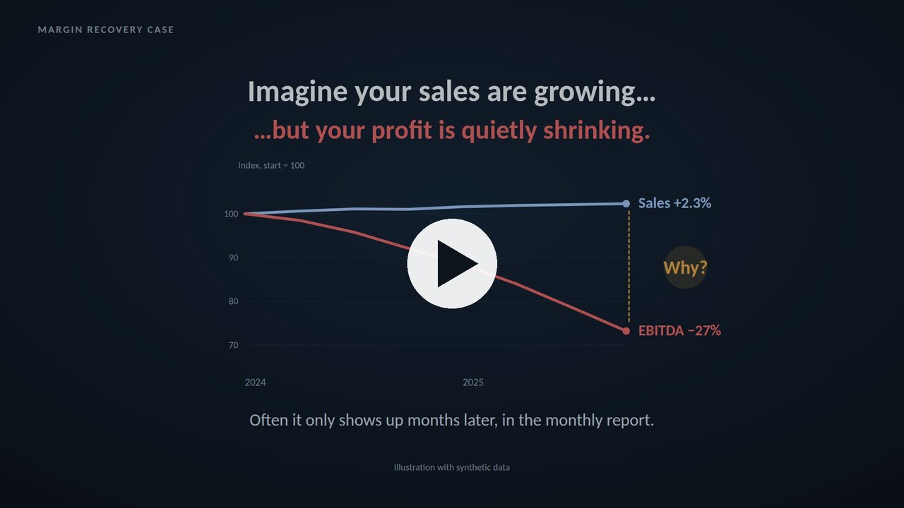
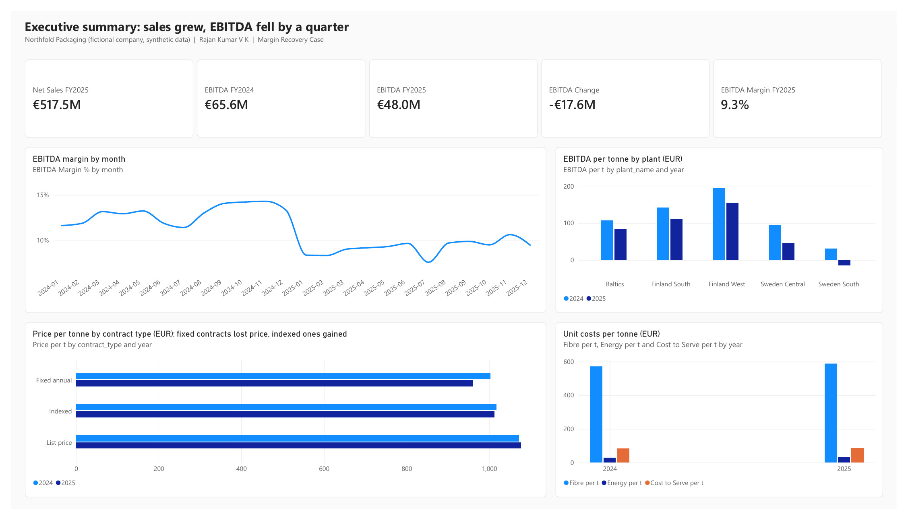
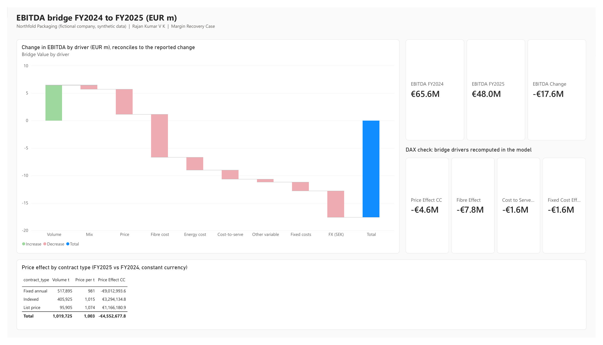
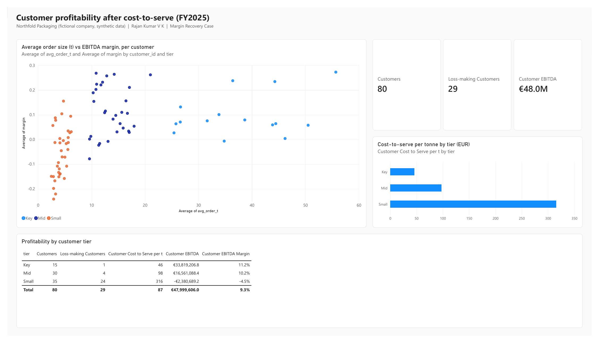
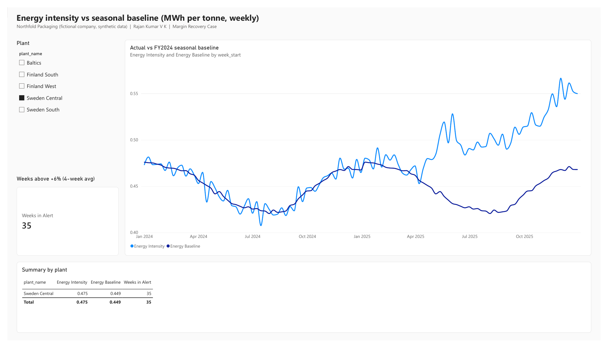
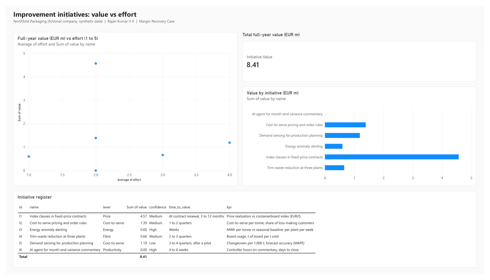

# Margin Recovery Case: sales grew, EBITDA fell by a quarter

**Live page:** https://rajan56.github.io/margin-recovery-case/

**80-second walkthrough:** click the image to play the video (captions on screen, no sound needed).

[](https://rajan56.github.io/margin-recovery-case/docs/margin_recovery_case_80s.mp4)

This repository is a worked business performance case. It takes a margin problem from raw data to a decision:

- one integrated dataset
- a driver-based EBITDA bridge
- customer profitability after cost-to-serve
- weekly energy anomaly detection
- an FY2026 scenario simulator
- a prioritised AI and automation plan, with a way to prove each initiative delivered

> **Northfold Packaging is a fictional company and every number is synthetic.** The market conditions in the data follow publicly discussed trends in the Nordic packaging industry: flat sales, softer prices, tight fibre supply, higher energy and freight costs, and a weaker SEK. No company's internal data is used or implied.

## The answer in brief

| | FY2024 | FY2025 |
|---|---|---|
| Net sales | €505.7m | €517.5m (+2.3%) |
| EBITDA | €65.6m | €48.0m (−€17.6m) |
| EBITDA margin | 13.0% | 9.3% |

1. **Market drivers explain most of the decline.** Fibre, energy and FX together account for €15.0m.
2. **Controllable leaks:**
   - Fixed annual contracts lost €9.0m of price while indexed contracts rose.
   - 29 accounts, 24 of them small, are EBITDA-negative once cost-to-serve is counted.
3. **Hidden issue:** energy intensity at one plant drifted about 17% above its baseline. A weekly rule catches it six weeks after it starts. The monthly report showed only +4.3%.
4. **Five initiatives are worth about €8.4m a year** (+1.6 pp margin). Each has a KPI, an owner and a review rhythm.

## Repository structure

```
data/                 synthetic star-schema CSVs + case_results.json
python/
  01_generate_data.py        builds the synthetic dataset (seeded, reproducible)
  02_analysis.py             P&L, EBITDA bridge, customer profitability, energy alerting, initiatives
  03_validate_sql.py         runs every SQL view on SQLite and checks it against Python (18 checks)
  04_scenario_model.py       FY2026 scenario model and sensitivity table
  05_ai_variance_commentary.py   AI agent: facts → LLM draft → number check → human review
  06_build_page.py           builds index.html from site/ + results
  07_build_tmdl.py           writes the Power BI semantic model as a TMDL script
  08_build_pbir.py           writes the Power BI report pages (PBIR)
sql/
  01_schema.sql              star schema
  02_pnl_by_year.sql
  03_ebitda_bridge.sql       customer-level bridge, constant currency, reconciles exactly
  04_customer_profitability.sql   cost-to-serve and whale curve
  05_energy_anomaly.sql      weekly seasonal-baseline alert with window functions
powerbi/
  margin_recovery_case.pbix  the Power BI report (5 pages)
  model.tmdl                 TMDL script that creates the semantic model
  measures.dax               calculated columns and DAX measures
  BUILD_GUIDE.md             step-by-step Power BI build, with expected values to check against
  outputs/                   flat outputs for Power BI pages
site/                 page template and JavaScript (no external libraries)
docs/                 walkthrough video, AI agent draft output, screenshots
video/                source of the 80-second walkthrough (SVG animation drawn from case_results.json)
index.html            the published page (GitHub Pages)
```

## Run it

```bash
pip install -r requirements.txt
cd python
python 01_generate_data.py
python 02_analysis.py
python 03_validate_sql.py        # expect: ALL CHECKS PASSED
python 04_scenario_model.py
python 05_ai_variance_commentary.py          # rule-based draft
# ANTHROPIC_API_KEY=... python 05_ai_variance_commentary.py --llm   # LLM draft, same number check
python 06_build_page.py
```

## Method notes

**EBITDA bridge.** Built at customer level. Each driver is defined as follows:

| Driver | Definition |
|---|---|
| Volume | Change in total tonnes × FY2024 average unit contribution |
| Mix | Shift in tonnes between customers with different FY2024 unit contribution |
| Price and cost drivers | FY2025 tonnes × change in rate per tonne, at constant currency |
| FX | Translation effect of the SEK move |

The drivers reconcile to the reported change within €0.03.

**Constant currency.** FY2025 SEK amounts are restated at the same month's FY2024 rate.

**Cost-to-serve.** Freight is allocated on deliveries and order handling on orders. Order handling covers changeovers, set-up waste and planning.

**Energy alert.** Each week is compared with the plant's own FY2024 seasonal baseline (smoothed over five weeks). An alert fires when the four-week deviation stays above +6% for three weeks in a row.

**AI agent.** The LLM only receives verified facts. Every number in its draft is traced back to those facts before a controller sees it, and nothing is published without human sign-off.

## Walkthrough video

`docs/margin_recovery_case_80s.mp4` (1920x1080, 30 fps, 80 s) is generated from code, not edited by hand. `video/animation_src.html` draws every frame as SVG from a single time value, using the same `case_results.json` as the page. `video/render.js` steps through the frames with Playwright and encodes them with ffmpeg.

```bash
cd video
python build.py                                     # embeds the case data into animation.html
node render.js margin_recovery_case_80s.mp4         # needs Node, Playwright and ffmpeg
```

Open `video/animation.html` in a browser to watch the animation loop live.

## Power BI report

`powerbi/margin_recovery_case.pbix` is the finished report. Open it in Power BI Desktop. If the data folder is somewhere other than `C:\Users\rajan\Documents\margin-recovery-case`, update the CSV paths in Power Query and refresh.

The report has five pages:

1. Executive summary
2. EBITDA bridge
3. Customer profitability
4. Energy
5. Initiatives

The key DAX measures were checked against the Python and SQL results:

| Measure | FY2024 | FY2025 | Effect |
|---|---|---|---|
| EBITDA | €65.61m | €48.00m | |
| Price effect | | | −€4.55m |
| Fibre effect | | | −€7.83m |
| Cost-to-serve effect | | | −€1.63m |
| Fixed cost effect | | | −€1.62m |

The model and report are also defined as code:

- `python/07_build_tmdl.py` writes `powerbi/model.tmdl`, the TMDL script for the semantic model: tables, Power Query sources, relationships and DAX measures.
- `python/08_build_pbir.py` writes the report pages in PBIR format.

To build the model from scratch, open Power BI Desktop, go to **TMDL view**, paste the script and click **Apply**. `BUILD_GUIDE.md` covers the same steps by hand.







## Author

Rajan Kumar V K, D.Sc. in Industrial Engineering and Management (LUT University). [LinkedIn](https://www.linkedin.com/in/rajan-kumar-v-k-0a541799/)
